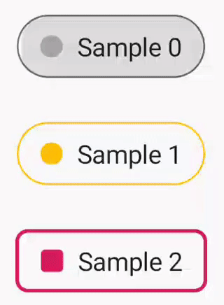

# CheckableChipView

[](https://travis-ci.org/okdroid/checkable-chip-view) [](https://bintray.com/markushi/maven/checkablechipview/_latestVersion)

A checkable widget for Android. Based on the [EventFilterView from the Google I/O 2018 app](https://github.com/google/iosched/blob/2696fc7e06826ba2db72de243f0d63f83f4a29b5/mobile/src/main/java/com/google/samples/apps/iosched/ui/schedule/filters/EventFilterView.kt). 

Requires Android `minSdkVersion` 21.



## Setup
Make sure you have the jcenter repo in your project level `build.gradle`  
```gradle
allprojects {
    repositories {
        jcenter()
    }
}
```

Add the dependency to your lib/app `build.gradle`  
```gradle
dependencies {
    implementation 'com.github.okdroid:checkablechipview:2.0.0'
}
```

## Usage

### XML
Include the widget into your xml layout like this
```xml
<com.github.okdroid.checkablechipview.CheckableChipView
        android:id="@+id/chip"
        android:layout_width="wrap_content"
        android:layout_height="wrap_content"
        android:text="Pie Cake" />
```

The following xml attributes are supported

| Attribute                     | Description                                                  |
| ----------------------------- | ------------------------------------------------------------ |
| `android:text`                | The text to display                                          |
| `android:textColor`           | The default text color                                       |
| `android:color`               | The color of the indicator dot as well as the background color when the widget is checked |
| `android:background`          | The default background color                                 |
| `android:checked`             | The checked state of the widget, either `true` or `false`    |
| `app:ccv_outlineColor`        | The color of the outline                                     |
| `app:ccv_outlineCornerRadius` | The corner radius of the outline, in dp. Defaults to a pill shape if not set |
| `app:ccv_outlineWidth`        | The stroke width of the outline, in dp                       |
| `app:ccv_checkedTextColor`    | The text color when the widget is checked                    |
| `app:ccv_foreground`          | The foreground drawable to display                           |

### In code
The state of the widget can be observed like this
```kotlin
chip.onCheckedChangeListener = { view: CheckableChipView, isChecked: Boolean ->
    // do your logic here
}
```

To switch between checked/unchecked state programatically with animation, use the following method:
```kotlin
chip.setCheckedAnimated(checked = true) {
    // onAnimationEnd callback
}
```

Plus, there are following methods at your service for changing the state without animation:
```kotlin
if (!chip.isChecked) {
    chip.isChecked = true
}

chip.toggle() // toggles between states
```

## Acknowledgements
Thanks to the team behind the [Google I/O app](https://github.com/google/iosched). Thank you for open sourcing the code and letting others reuse and learn from it.

Thanks to [Nick Butcher](https://github.com/nickbutcher) for the initial implementation in the I/O app.

## License
    Copyright 2018 Google, Inc.
    Copyright 2018 okdroid

    Licensed under the Apache License, Version 2.0 (the "License");
    you may not use this file except in compliance with the License.
    You may obtain a copy of the License at

       http://www.apache.org/licenses/LICENSE-2.0

    Unless required by applicable law or agreed to in writing, software
    distributed under the License is distributed on an "AS IS" BASIS,
    WITHOUT WARRANTIES OR CONDITIONS OF ANY KIND, either express or implied.
    See the License for the specific language governing permissions and
    limitations under the License.
